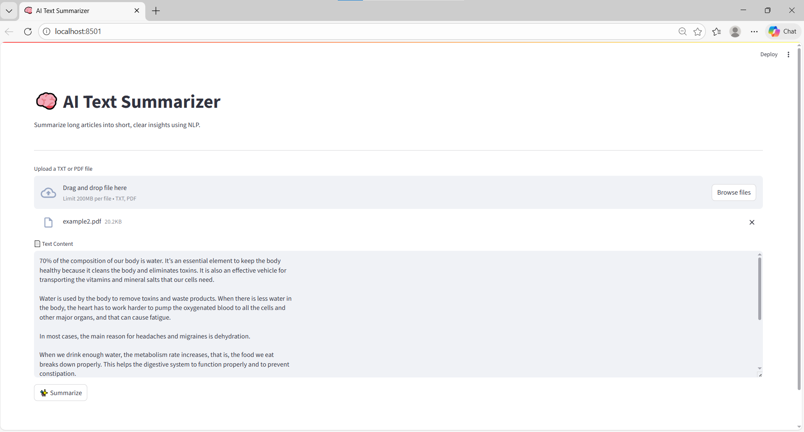

# AI Text Summarizer

## Description:
AI Text Summarizer is a Streamlit application that allows users to upload text or PDF files and automatically generate a concise summary using transformer-based AI models.
## Screenshots:

## Features:
- Upload TXT or PDF files
- Automatic AI-generated summary
- Simple and user-friendly interface

## How to Run

1. Install required packages:
pip install -r requirements.txt

2. Run the application:
streamlit run app2.py

## Tech Stack
- Python
- transformers
- streamlit
- PyPDF2

## Future Improvements
- Add button to download the summary
- Improve handling of very long texts
- Add multiple summarization styles (short / detailed)

## Author
Hiba Munther Daher  
LinkedIn: (https://www.linkedin.com/in/hiba-daher-691534362?utm_source=share&utm_campaign=share_via&utm_content=profile&utm_medium=android_app)
